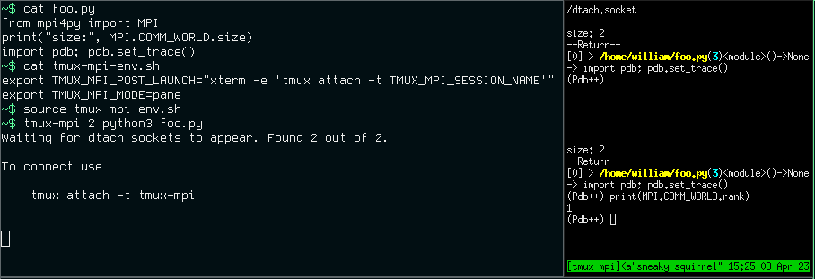

TMUX-MPI
========

Introduction
------------

tmux-mpi connects MPI processes to tmux windows. MPI launches n instances of dtach, these n instances are then connected to in tmux windows. 
To launch a command use:
::
    
    tmux-mpi <nproc> <command>

For example,
::
    
    tmux-mpi 2 hostname

will start a tmux session called ``tmux-mpi`` that can be connected to in a different terminal with
::

    tmux attach -t tmux-mpi

or use
::

    tmux attach

if there are no other tmux sessions. You may need to scroll up in the tmux window to see the output of this example.
This dtach approach does mean that if the program crashes manual cleanup may need to happen. For example:
::

    pkill -9 dtach

Copyright 2020, WR Saunders

Installation
------------
Requires dtach and tmux to be installed. 
This tool can be installed at a user account level with `pipx <https://github.com/pypa/pipx>`_ and the command:
::

    pipx install git+https://github.com/wrs20/tmux-mpi@master

Pip installable into to a virtual environment with:
::
    
    pip install --upgrade --no-cache-dir git+https://github.com/wrs20/tmux-mpi@master

Configuration
-------------
Some environment variables can be set to configure behaviour. These are environment variables such that they can be set once somewhere in an environment.

``TMUX_MPI_MPIRUN``
  Configure how ``mpiexec`` is called, e.g. ``TMUX_MPI_MPIRUN="mpiexec -s all"`` for recent Intel MPI.
``TMUX_MPI_POST_LAUNCH``
  Configure a command to launch after the processes have started, e.g. ``TMUX_MPI_POST_LAUNCH="xterm -e 'tmux attach -t TMUX_MPI_SESSION_NAME'"`` would launch a new ``xterm`` and connect to the created server. The string ``TMUX_MPI_SESSION_NAME`` will be replaced with the actual session name.
``TMUX_MPI_MODE``
  Choose if each rank should be in a new tmux window using ``window`` (default) or ``pane``, e.g. ``TMUX_MPI_MODE=pane``.
``TMUX_MPI_SYNC_PANES``
  Synchronises the input to the tmux panes when using ``TMUX_MPI_MODE=pane``, e.g. ``TMUX_MPI_SYNC_PANES=1``. Default off. Note that this uses the pane synchronisation built into tmux.

Examples
--------

Try the following to start debugging a Python program using a C extension in GDB and 2 MPI ranks. The environment variable will automatically launch a xterm window to connect to the session.
Note that tmux window numbers are not MPI ranks (this functionality would require this tool to access the MPI implementation somehow).
::
    
    # Start a xterm that connects to the session
    export TMUX_MPI_POST_LAUNCH="xterm -e 'tmux attach -t TMUX_MPI_SESSION_NAME'"
    # launch tmux-mpi
    tmux-mpi 2 gdb --ex run --args python <script-name>

Same as above but using tmux panes instead of windows and synchronised input:
::
    
    # Start a xterm that connects to the session
    export TMUX_MPI_POST_LAUNCH="xterm -e 'tmux attach -t TMUX_MPI_SESSION_NAME'"
    # use panes not windows
    export TMUX_MPI_MODE=pane
    #synchronised inputs
    export TMUX_MPI_SYNC_PANES=1
    # launch tmux-mpi
    tmux-mpi 2 gdb --ex run --args python <script-name>

Known Issues and Workarounds
----------------------------

GDB Pagination
~~~~~~~~~~~~~~
By default GDB displays some text on launch.
If this text exceeds the available space then GDB enters pagination mode which pauses the execution until enter is sent in the paused windows. 
The normal GDB config file (``~/.gdbinit``) is applied after the this startup text is presented, hence disabling pagination in that config file does not solve the problem.
Instead disable pagination, and optionally the startup text altogether, in the ``~/.gdbearlyinit`` file with the following options.
::

    set pagination off
    set startup-quietly
    

Intel MPI
~~~~~~~~~
Some (recent?) versions of Intel MPI try to do stdin redirection by default. If you have issues with ranks not starting try the following (as demonstrated using python):
::
    
    TMUX_MPI_MPIRUN="mpiexec -s all" tmux-mpi 2 python

macOS Crash Reporter
~~~~~~~~~~~~~~~~~~~~

I have managed to disable the macOS crash reporter that presents the "Application quit unexpectedly" pop-up with the following command in a terminal. 
Your mileage may vary for this fix.
::

    defaults write com.apple.CrashReporter DialogType none

